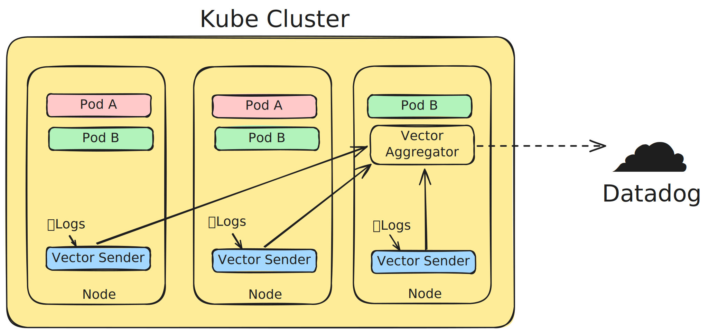

# Kubernetes ➡️ Datadog logs sender

Helm chart to set up sending logs from a Kubernetes cluster to Datadog. [Vector](https://vector.dev) is used under the
hood.

This is an example of how to use Vector to send logs to Datadog author couldn't find when
he was trying to set it up.
It's also the author's exercise to learn writing Helm charts.

It is based on Axiom's [instruction](https://axiom.co/docs/send-data/kubernetes) on setting up Vector.

## Features

* Lightweight and fast.
* Supports excluding logs from log collection by service name and log level.

## Installation

### Helm

1. Create Kubernetes secret with Datadog API key:
   ```shell
   kubectl create secret generic datadog-creds --from-literal=DD_API_KEY=<YOUR_DATADOG_API_KEY>
    ```
   (make sure to create it in the `kube-system` namespace as the chart is deployed there)
2. Add the Helm repository:
   ```shell
   helm repo add kube-logs-datadog-sender https://igor-vovk.github.io/kube-logs-datadog-sender/
   ```
3. Install the chart:
   ```shell
   helm install kube-logs-datadog-sender kube-logs-datadog-sender/kube-logs-datadog-sender
   ```

### ArgoCD Application
Example of ArgoCD Application manifest:
```yaml
apiVersion: argoproj.io/v1alpha1
kind: Application
metadata:
  name: kube-logs-datadog-sender
  namespace: argocd
spec:
  project: default
  source:
    chart: kube-logs-datadog-sender
    repoURL: https://igor-vovk.github.io/kube-logs-datadog-sender/
    targetRevision: 0.1.2
    helm:
      valuesObject:
      # configuration of a sender, see chart's values.yaml for all available options
  destination:
    server: https://kubernetes.default.svc
    namespace: kube-system
  syncPolicy:
    automated:
      prune: true
      selfHeal: true
```

## Architecture



Sender-Aggregator pattern is used to send logs to Datadog:

* Senders are deployed on each node in the cluster. They collect logs from the node, process and filter them, and then
  send logs to the aggregator.
* Aggregator collects logs from all senders and then sends them to Datadog.

## Points of Improvement

* Consider having thin senders and doing parsing and filtering in the aggregator instance.
* Right now parsing is most optimized for the Logback logs format. Figure out how to make it more generic.
* More flexible Vector configuration from Helm chart.

## Referral Links

Help me to pay my Datadog bills by following those links:

* [Hetzner Cloud](https://hetzner.cloud/?ref=iAnthJAtoQ8d) – best cloud provider with the cheapest prices in the EU
* [Bybit](https://www.bybit.nl/invite?ref=EVWANAG) – best crypto exchange